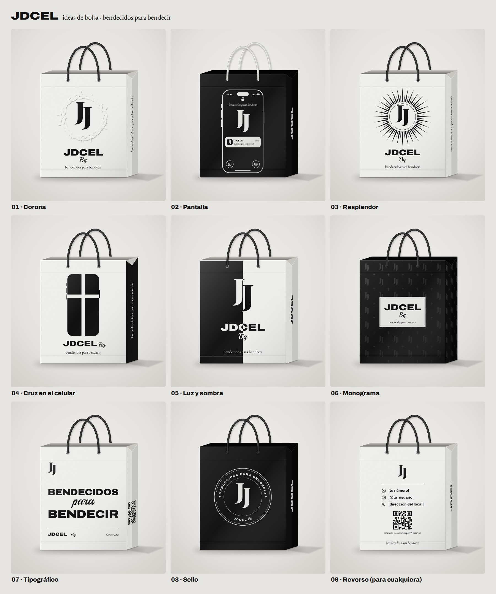
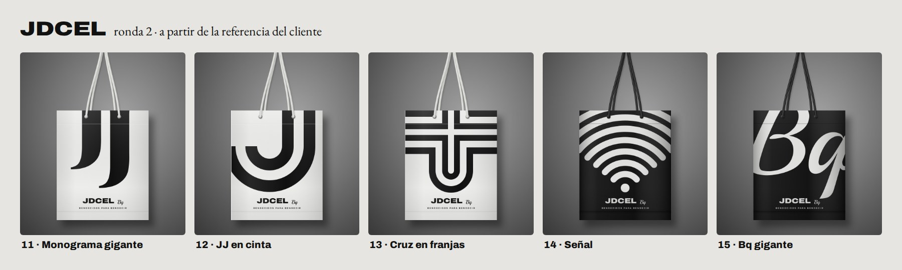

# Bolsa JDCEL Bq: ideas de diseño

Propuestas de bolsa para **JDCEL Bq** (celulares) en negro y blanco. Todas mantienen el nombre y el eslogan **«bendecidos para bendecir»**.



> **Ojo:** el monograma JJ de los bocetos es una aproximación hecha con tipografía (Playfair Display). Para producción se reemplaza por el vector original del logo. Las demás letras sí coinciden: **Archivo** extendida (JDCEL), **Playball** (Bq) y **EB Garamond** (eslogan), todas gratis en Google Fonts.

## Notas sobre la propuesta original

1. **El rostro compite con el logo.** El JJ cae justo sobre los ojos y la nariz, y la vista no sabe dónde mirar. Opciones: dejar solo la corona (01), bajar mucho el contraste del rostro y subirlo, o llevarlo al reverso.
2. **Demasiados elementos apilados** (monograma, JDCEL, Bq, eslogan, íconos). Mejor un solo bloque de logo (JJ + JDCEL + Bq), el eslogan aparte y el contacto en el fuelle o en el reverso.
3. **Íconos sin datos no sirven:** hay que poner el número, el @usuario o un QR (09).
4. **Costo:** un relieve que cubre toda la cara necesita un troquel grande, y en cartulina laminada puede cuartearse. El barniz UV selectivo sobre laminado mate da un efecto tono sobre tono parecido por menos.
5. **Tema sensible:** una bolsa suele terminar en el piso o en la basura, y muchas iglesias evangélicas evitan las imágenes de Jesús. Conviene confirmarlo con el dueño; la corona, la cruz o la luz funcionan para cualquier creyente.

## Propuestas

| # | Nombre | Color | Idea | Impresión sugerida |
|---|---|---|---|---|
| 01 | Corona | Blanca | La idea original, depurada: solo la corona de espinas en relieve, rodeando el JJ. | Relieve seco solo en la corona (troquel pequeño) + logo en negro mate |
| 02 | Pantalla | Negra | La bolsa es un celular bloqueado: el JJ es el reloj, el eslogan la fecha, llega una notificación de JDCEL y WhatsApp/Instagram son los botones. Cordón blanco tipo cable de cargador. | Serigrafía o hot stamping blanco sobre papel negro |
| 03 | Resplandor | Blanca | Rayos alrededor del JJ: se leen como luz y como señal. | 1 tinta negra |
| 04 | Cruz en el celular | Blanca, fuelles negros | La silueta de un celular partida por una cruz en el espacio blanco. | 1 tinta negra |
| 05 | Luz y sombra | Mitad y mitad | Todo cambia de color al cruzar la línea: luz en la oscuridad (Juan 1:5). | 1 tinta negra (el negro es fondo) |
| 06 | Monograma | Negra | Patrón de JJ y cruces que aparece con la luz + etiqueta blanca con el logo. | UV selectivo brillante sobre laminado mate + blanco |
| 07 | Tipográfico | Blanca | El eslogan como protagonista; cita Génesis 12:2, el versículo del que sale. QR en el fuelle. | 1 tinta negra |
| 08 | Sello | Negra | Sello circular con el eslogan alrededor del JJ; sirve también como sticker de cierre. | Blanco sobre negro |
| 09 | Reverso | Blanca | Cara trasera para cualquier opción: WhatsApp, Instagram, dirección y QR. | 1 tinta negra |
| 10 | Monograma claro | Blanca | Diseño nuevo: patrón gris claro de JJ y cruces, logo grande y el WhatsApp y el Instagram reales al frente. El arte original está en `arte-frente/10-monograma-claro.png`. | Negro y gris claro (el gris como trama del negro) |

Los textos entre corchetes (`[tu número]`, `[@tu_usuario]`, `[dirección del local]`) y el «¡Gracias por tu compra!» son de ejemplo. El QR de los bocetos es de relleno: hay que generar el real (por ejemplo, un enlace `wa.me` al número de la tienda).

## Ronda 2 · a partir de la referencia del cliente



De la bolsa de referencia se toma la estructura, no el dibujo: el símbolo de la marca en gigante y recortado por los bordes, dos colores (aquí negro y blanco) y el logo pequeño abajo, con aire. La «S» de la referencia es de otra marca, así que no se copia. Las bolsas se muestran colgando sobre fondo gris, como en la foto de referencia.

| # | Nombre | Bolsa | Idea | Impresión |
|---|---|---|---|---|
| 11 | Monograma gigante | Blanca, cordón blanco | El JJ en gigante, recortado por arriba. | 1 tinta negra |
| 12 | JJ en cinta | Blanca, cordón blanco | Las J del logo como cintas gruesas, una dentro de la otra. | 1 tinta negra |
| 13 | Cruz en franjas | Blanca, cordón blanco | Franjas de lado a lado que forman una cruz latina y bajan en curvas en U. | 1 tinta negra |
| 14 | Señal | Negra, cordón negro | La señal de wifi en gigante: celulares y bendición que se comparte. | Blanco (serigrafía o hot stamping) |
| 15 | Bq gigante | Negra, cordón negro | La «Bq» del logo en caligrafía gigante, recortada por los bordes. | Blanco (serigrafía o hot stamping) |

Presentación: `JDCEL-propuestas-bolsa-ronda-2.pptx`. Para Canva: `canva/JDCEL-bolsas-ronda-2.pptx` (las cinco) o cada una por separado (`canva/11-…` a `canva/15-…`).

## Producción

- **Tamaños:** mediana 25 × 30 × 10 cm (celular en su caja + accesorios); pequeña 18 × 22 × 8 cm (accesorios).
- **Papel:** propalcote o cartulina esmaltada de 250 g con laminado mate. Para las negras, mejor cartulina negra en masa: al rayarse no deja ver el blanco.
- **Manijas:** cordón negro o blanco; cinta de gorgorán para una versión más premium.
- **Boca:** los 3–4 cm de arriba se doblan hacia adentro; no pongas nada importante ahí.

## Editar en Canva

La carpeta `canva/` tiene cada frente armado por piezas para que Canva lo convierta en un diseño editable:

1. En [canva.com](https://www.canva.com), desde el computador: **Crear un diseño → Importar archivo** y elige un `.pptx` (o arrástralo a la ventana).
2. `JDCEL-bolsas-9-disenos.pptx` trae las nueve bolsas de la ronda 1, una por página, y `JDCEL-bolsas-ronda-2.pptx` las cinco de la ronda 2; `01-corona.pptx` … `15-bq-gigante.pptx` traen cada una por separado. Cada página mide 25 × 30 cm.
3. Los textos se editan como texto; las formas y los gráficos se mueven y cambian de color; el logo (JJ, JDCEL, Bq) va como gráfico para reemplazarlo por el original.

Si Canva importa algo raro, `canva/pdf/` tiene los mismos diseños en PDF (Canva también los vuelve editables). Con Canva Pro se pueden subir sueltos los SVG de `canva/elementos/`. Más detalles en `canva/LEEME.txt`.

## Archivos

- `JDCEL-propuestas-bolsa.pptx`: presentación con las bolsas montadas (portada, las diez de un vistazo, una diapositiva por propuesta con su arte del frente, tabla comparativa y cómo producirla). Las notas del orador explican cada idea.
- `JDCEL-propuestas-bolsa-ronda-2.pptx`: presentación de la ronda 2 (portada, qué se tomó de la referencia, las cinco de un vistazo, una diapositiva por propuesta y cómo producirla).
- `mockups/`: imágenes JPG de cada bolsa (1800 × 2000 px) y la lámina con todas.
- `arte-frente/`: el frente de cada propuesta en SVG editable (25 × 30 cm). Se abre en Illustrator, Figma o Inkscape; instala las fuentes o conviértelas en contornos.
- `canva/`: los mismos frentes listos para importar en Canva (`.pptx`, `.pdf` y gráficos sueltos en SVG).
- `fuente/`: los scripts que generan todo, por si hay que hacer ajustes (Node 22 + Playwright con Chromium; Python para Canva; pptxgenjs para la presentación):

  ```sh
  cd bolsa-jdcel/fuente
  sh fetch-fonts.sh   # descarga las fuentes a fonts/
  node build.mjs      # genera out/*.jpg y out/svg/*.svg
  node overview.mjs   # lámina de la ronda 1 (node overview.mjs ronda-2 para la ronda 2)
  pip install python-pptx fonttools brotli uharfbuzz pyclipper svgelements
  python3 canva.py    # regenera la carpeta canva/ (los PDF necesitan LibreOffice Impress)
  npm install && node presentacion.mjs   # regenera las dos presentaciones
  ```
